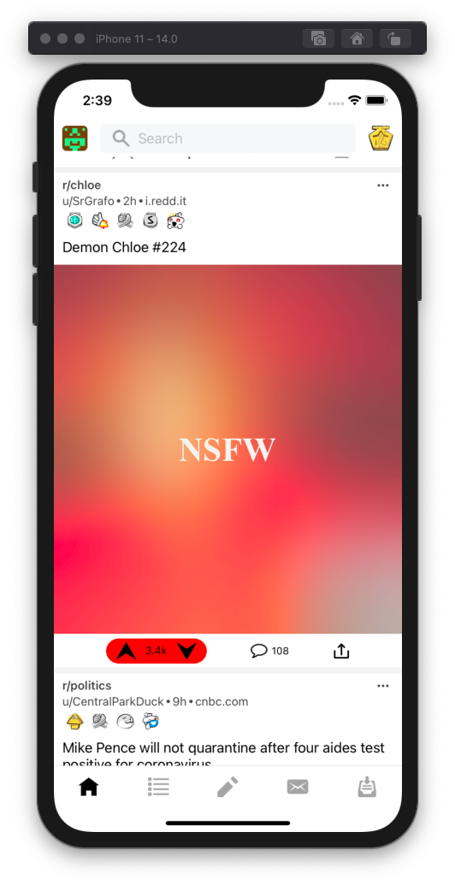
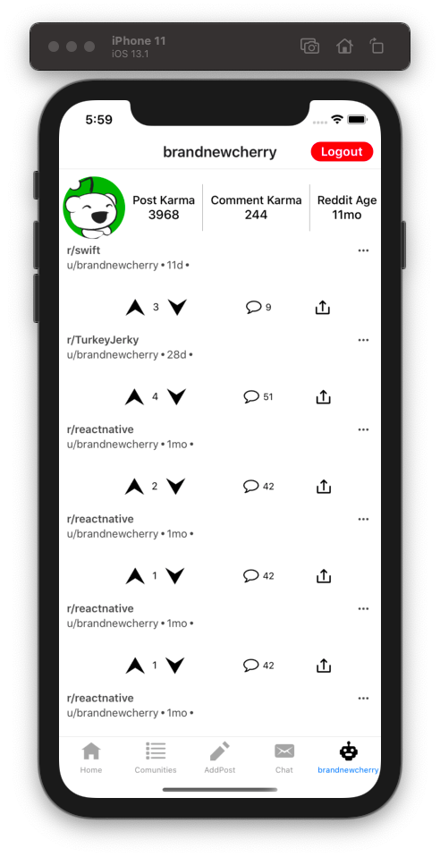

# RN-RedditClient

## Simple Reddit client written in RN.

### How To Use
- `git clone https://github.com/1hbb/RN-RedditClient.git`
- `cd  RN-RedditClient`
- `npm install`
- For ios only `cd ios && pod install && cd .. && react-native run-ios`
- For android onyl `react-native run-android`

# Screenshots
<table>
  <tr>
    <td></td>
    <td></td>
    <td></td>
  <tr>
  <tr>
    <td></td>
    <td></td>
    <td></td>
  <tr>
</table>
